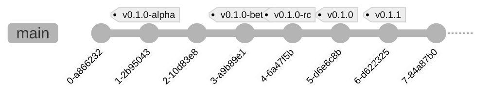
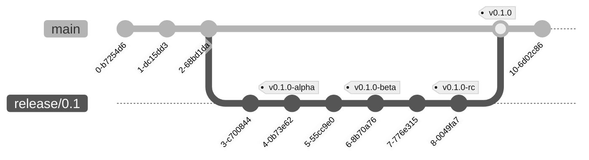

# Fluxos

Algumas pré-considerações:

- A branch principal se chama `main`
- Toda tag de versão é prefixada com `v`. Ex: `v0.1.0`

## simple-trunk-based-flow

O desenvolvimento simples baseado no tronco prevê que tudo é feito
na branch principal, e sempre que se considera algo que possa ser
liberado como uma versão (estável ou não), se cria uma tag diretamente.

## stable-release-flow

Este fluxo considera o _thunk-based_ como escolha, e quando se deseja
liberar uma versão, então criamos uma branch para estabilizá-la.
Onde testes são feitos e possíveis correções de estabilização da
versão são aplicáveis.

Regras:

- Quando há uma versão sendo estabilizada nenhum commit na branch
  principal é permitido
- As tags de versão são sempre em _commits_ da branch principal (_main_).

## incremental-release-flow

> Este fluxo é uma extensão de `stable-release-flow`.

Considera-se que enquanto uma versão está sendo establilizada, uma
próxima versão pode ser construída em paralelo.

Ideal para times ágeis que entregam incrementos sequenciais.

Regras:

- Não se pode liberar uma versão final qualquer enquanto houver outra
  outra menor em aberto. Ex: Não se libera uma `release/0.2` enquanto
  uma `release/0.1` existir.
- Sempre que uma versão final é liberada as próximas versões em aberto
  devem ser atualizadas. Ex: liberando uma `release/0.1`, enquanto uma
  `release/0.2` existir, após liberação, `main` deve ser juntada a 
  `release/0.2` (_merge_). 
- As tags de versão são sempre em _commits_ da branch de _release_.
- Qualquer commit na branch principal (_main_) é considerado pertencente
  a próxima versão

## topic-branch-flow

Baseado no trunk-based-flow onde apenas os commits não são feitos
diretamente na branch principal.

As tags continuam sendo geradas igualmente.

## trunk-based-hotfix-flow

Uma branch de correção é feita à partir de um commit de tag e corrigido.
Uma outra tag é feita à partir dessa branch, que é reintegrada a branch
principal.

Cherry-pick é usado para aplicar a correção a possíveis versões maiores
quando necessário.

## topic-stable-release-flow

Baseado em `stable-release-flow` mas com acréscimo da mudança imposta
a `trunk-based-flow` por `topc-branch-flow`. Também as correções neutral
release não são feitas diretamente, mas por tópicos de `bugfix/*`.

