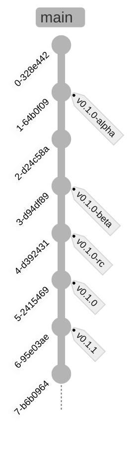

# Fluxos

Algumas pré-considerações:

- A branch principal se chama `main`
- Toda tag de versão é prefixada com `v`. Ex: `v0.1.0`

## Simple trunk-based flow

O desenvolvimento simples baseado no tronco prevê que tudo é feito
na branch principal, e sempre que se considera algo que possa ser
liberado como uma versão (estável ou não), se cria uma tag diretamente.

## Stable release

Este fluxo considera o _thunk-based_ como escolha, e quando se deseja
liberar uma versão, então criamos uma branch para estabilizá-la.
Onde testes são feitos e possíveis correções de estabilização da
versão são aplicáveis.

